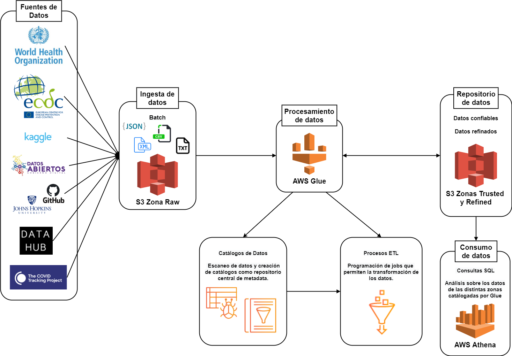

# AWS Datalake Covid19
A datalake deployed in Amazon Web Services which aims to bring together relevant data about covid-19 from multiple data sources such as the European Centre for Disease Prevention and Control. Data includes daily cases, deaths, hospitalization, genomes and scientific publications.

